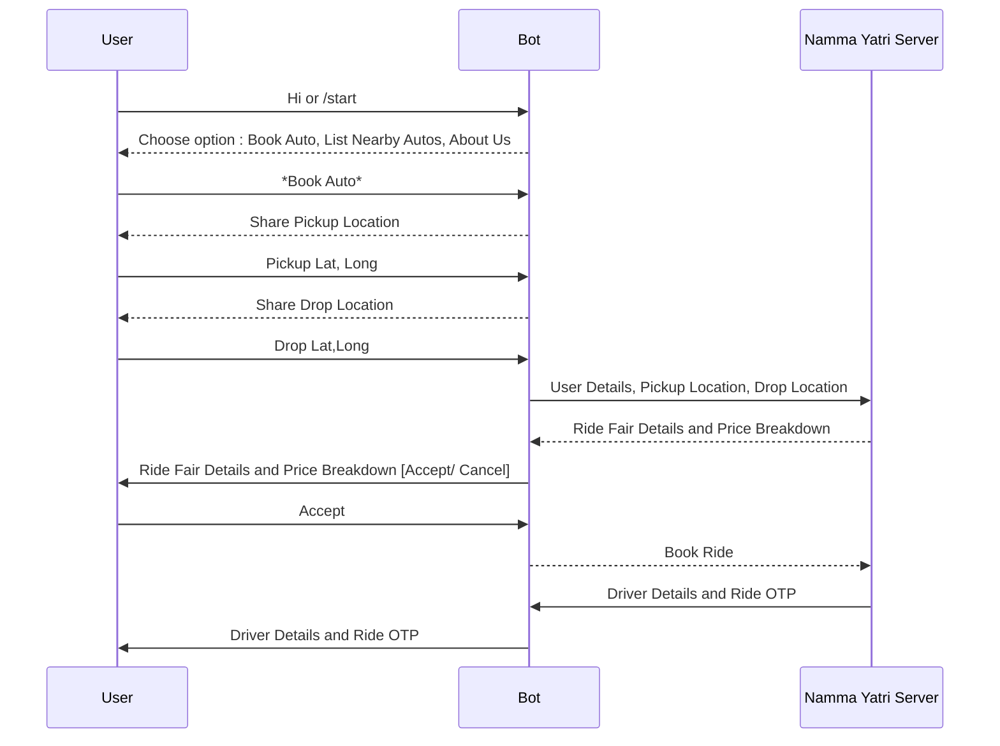
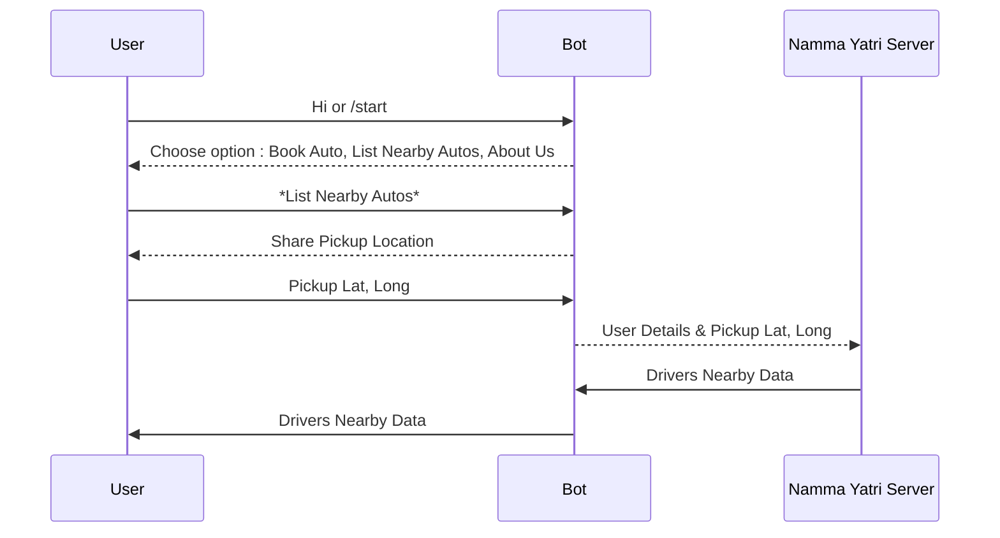

|  |  |
|--|--|

## Namma Yatri - Open Challenge

### About Us
**Our solution for Namma Yatri's auto booking platform is to leverage the power of messaging platforms like WhatsApp, Telegram and Voice Assistants like Alexa, Google Assistant, Siri and WebApp to enable users to book a ride without the need for installing an app.**

### Submission Files

Presentation : [https://docs.google.com/presentation/d/1VxkloKyagqp-ytae3LLctNn9OrdKvqKUrJF21fx10TE/edit?usp=sharing](https://docs.google.com/presentation/d/1VxkloKyagqp-ytae3LLctNn9OrdKvqKUrJF21fx10TE/edit?usp=sharing)

WhatsApp Bot Link : [https://wa.me/9966960618?text=Hi](https://wa.me/9966960618?text=Hi)

Telegram Bot Link : [https://telegram.me/namma_yatri_bot](https://telegram.me/namma_yatri_bot)

Bot Source Code : [https://github.com/pranavms13/cab-bot](https://github.com/pranavms13/cab-bot)

Alexa Skill Source Code : [https://github.com/sandeepkumarmhere/nammayatri-alexa](https://github.com/sandeepkumarmhere/nammayatri-alexa)

WebApp Figma Design : [https://www.figma.com/file/37rT2ixrGNIMR1BQnKkNvc/Namma-Yatri?node-id=13-87&t=hURhnCf2BmOSXY5z-0](https://www.figma.com/file/37rT2ixrGNIMR1BQnKkNvc/Namma-Yatri?node-id=13-87&t=hURhnCf2BmOSXY5z-0)

## Flow Diagrams

### WhatsApp / Telegram Bot

Booking Auto Flow :

Listing Nearby Drivers Flow :

